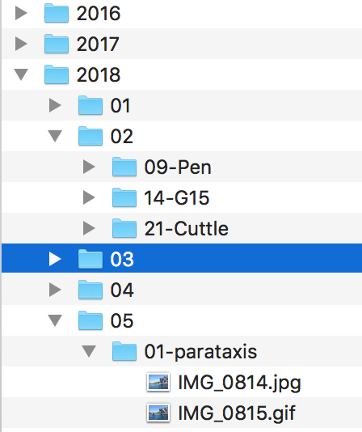

# photo-management
An overview of Soulflyer image management tools

These tools are designed to help speed up photo management and enable a photographer to locate images quickly and easily. The key to this is fast and effective keywording. None of the current photo processing packages seems to do this quite right, although some are better than others. The aim here is to allow commonly used keywords to be applied with only 1 or 2 keystrokes per photo and less commonly used ones with only a few more by making good use of autocompletion and keyboard shortcuts. Finding photos should be similarly easy. 

With a little preparation these tools, focused around the **hinh-anh** photo manager, will do that.

## Workflow

Everyone is different and there is no garuantee that these tools will play nicely with your own workflow. However they are designed to be used as a completely separate step after processing is finished so it should be ok. It makes no difference what tools you use to do the processing, and ratings and keywords will be picked up along with exif and IPTC data if you happen to apply them as part of that processing. As yet there is no provision to write keywords and captions etc back to the master copies but it is on the TODO list.

My workflow goes something like this:

* Photo processing using whatever program is best for the shoot. Usually this is the excellent [darktable](https://www.darktable.org/). Then export to ~/Pictures/fullsize/yyyy/mm/project
* Add watermark info using [watermarker](#watermarker)
* Export various sizes of pictures, with watermark, using the [versions](#versions) script. This automatically calls [save-meta](#save-meta) to add the picture details to the database for [hinh-anh](#hinh-anh) and other tools.
* Add keywords and refine ratings using [hinh-anh](#hinh-anh)
* run `backup-to-soulflyer` which uses rsync to send the newly exported pics to the web host machine.

## File sytem organisation

The processed master copies need to be accessible from a single path containing a `year/month/project` directory structure like this:

If this doesn't match your organisation it should be easy enough to use sym links to create this structure. The year month project thing is a core assumption though and things are pretty much garuanteed to break if the file system doesn't conform to it.

It is possible to work with just this one directory of pictures but it is a little slow when using the keywording tool on a large set of photos. My pictures are all exported in various sizes and these can be used instead when they are available. They too must have the year-month-project structure but it is possible to specify where those trees live. It's also possible to have as many or as few as required. I currently use 4 directories 

* thumbs fits in 160px
* small  fits in 512px
* medium fits in 1024px
* large  fits in 2048px

Normally I just use the medium directory for keywording purposes.

## Tools

## save-meta

This reads the metadata from an image or a directory of images and stores it in the database. It can be called from the command line or from a script. This is available [here](https://github.com/soulflyer/metadata-mongo).

It is called by the script that creates watermarked versions of the photos, but could also be run as part of the export from whatever processing program is used.

## versions

Creates the various sizes of photos for publication and use on the web. It adds the watermark, setting the position and strength according to the values saved in special instructions if they are present. Also triggers save-meta to add the photo details to the database. This is available as part of the **publish** repository available [here](https://github.com/soulflyer/publish). It relies on **convert** which is part of **Imagemagick** so you will need to install that and ensure it is on your path.

## watermarker

This is a mac only program that adds the watermark position and strength information to the image details in the database. It's available [here](https://github.com/soulflyer/Watermarker). This functionality will eventually be added to **hinh-anh** so it is available to linux users too. It is possible to set the watermark information in SpecialInstructions by hand, but without the visualisation provided by **watermarker** this can be a bit fiddly. The format looks like this:

BL14S12X02Y02

This means put the watermark in the bottom left, opacity 14, size 12, x-offset 2, y-offset 2

The watermark is found by the add-watermark script called by versions, and can be set as an option there. 
TODO:Move add-watermark out of the watermarker repository.

## hinh-anh

This is used to rate, tag and search photos. Available [here](https://github.com/soulflyer/hinh-anh).

## image-search

This can be called from the command line to perform simple searches. It can also be run in a clojure repl to do more complex searches. Either way can give a count of results found, open them in your default viewer, or write a list of the results to a file for further processing. This is available [here](https://github.com/soulflyer/image-search).

## image-lib

This is the heart of image-search and hinh-anh, but provided as a library for use in other situations.
